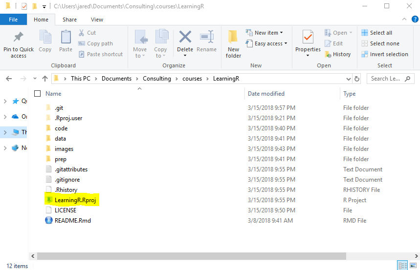

<!-- README.md is generated from README.Rmd. Please edit that file -->

# Introduction to R

This is an empty repo to initialize an R project for the [Introduction
to R](https://www8.gsb.columbia.edu/courses/mba/2018/fall/b8144-001)
Class at Columbia Business School.

Please follow all instructions to set up your environment for the
training.

# Packages

To get started run the following code in the R console to install the
latest version of the necessary packages. Be sure to have a recent
version of R, such as 3.5.1.

<div class="sourceCode">

<pre class='sourceCode r'><code class='sourceCode r'>
packages <- c(
    'coefplot', 
    'DBI', 
    'dbplyr', 
    'devtools', 
    'DT', 
    'dygraphs', 
    'ggthemes', 
    'glmnet', 
    'here', 
    'jsonlite', 
    'knitr', 
    'plotly', 
    'reshape2', 
    'rmarkdown', 
    'RSQLite', 
    'rvest', 
    'shiny', 
    'shinyjs', 
    'shinythemes', 
    'tidyverse', 
    'useful', 
    'usethis', 
    'UsingR', 
    'xgboost'
)
install.packages(packages)
</code></pre>

</div>

# Project Structure

Making use of [RStudio
projects](https://support.rstudio.com/hc/en-us/articles/200526207-Using-Projects)
greatly improves the user experience. To facilitate this users should
run the following code which will recreate this project on their
computer. Be sure to select the positive prompts such as `yes`, `yeah`,
etc.

``` r
newProject <- usethis::use_course('https://github.com/jaredlander/LearningR/archive/master.zip')
```

<!-- After that runs successfully you will have a new folder holding the R project that looks like this (the name in the image may be different). -->

<!-- ```{r proj-folder,echo=FALSE,out.width='50%'} -->

<!--  -->

<!-- ``` -->

After running this code you will be in an RStudio Project called
LearningR. You can see this in the top right of RStudio (the name in the
image may be different).

<!-- -->

# Data

Data for the class is kept at
[data.world](https://data.world/landeranalytics/training). Run the
following code to download all the data. This requires that you are
using an [RStudio
Project](https://support.rstudio.com/hc/en-us/articles/200526207-Using-Projects)
setup exactly like this repo, which is done if you followed the
preceding code.

``` r
source('prep/DownloadData.r')
```
